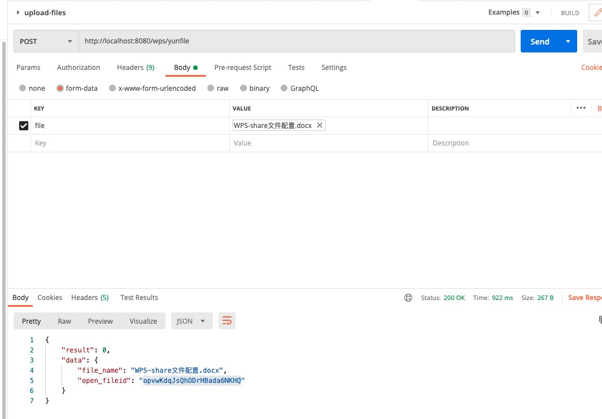

# README

WPS API接口集成,使用的技术工具:

- SpringBoot
- hutool
- springboot-openapi-ui
- retrofit2

项目启动后可以使用: http://localhost:8080/swagger-ui/index.html 访问接口文档

主要包括功能:
1. 自动刷新授权
2. 上传文件到wps
3. 分享上传的文件给其他人，其他人也有编辑权限

- [wps-open-api](https://open.wps.cn/docs/cloud/case-solution)

上传文件截图:

